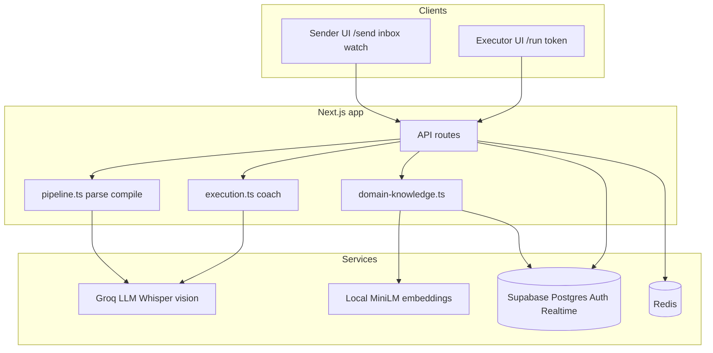

# Heiko - technical interview walkthrough (~15 min)

Script for: problem framing, system design, tradeoffs, failure modes. Pair with [STRUCTURE.md](./STRUCTURE.md) for a shorter recruiter version.

---

## 1. Problem framing (2-3 min)

### What problem did you choose?

**Heiko** helps when one person knows how to do something and another person has to execute it from written instructions - recipes, onboarding, repairs, lab protocols, admin processes.

The failure mode is not "bad writing." It is **missing tacit knowledge**: what "done" looks like, what to do when a step feels wrong, substitutions that only the expert knows. That knowledge lives in the expert's head, not in the doc.

### Why is it hard?

| Challenge | Why it matters |
|-----------|----------------|
| **Knowledge is implicit** | Experts skip steps they do every day; executors cannot infer them. |
| **Wrong moment** | Questions happen mid-task; the expert is async or unavailable. |
| **Unstructured input** | Real life is PDFs, screenshots, voice notes, not clean SOPs. |
| **No learning loop** | Same questions repeat on the next task; nothing accumulates. |
| **AI-only is not enough** | A generic chatbot hallucinates; it does not know *this* sender's cues. |

### What success looks like

- Executor finishes without constant back-and-forth.
- When they get stuck, help is **grounded** (package + sender answers), not invented.
- Sender answers **once**; the **current run** and **future runs** both improve.

**Elevator close:** "Instructions are a lossy compression of expertise. Heiko decompresses them at send time and coaches at run time, with a feedback loop when the model does not know."

---

## 2. System design (5-6 min)

### Architecture overview



### Core components

| Component | Responsibility |
|-----------|----------------|
| **Sender pipeline** (`lib/ai/pipeline.ts`) | Ingest multimodal input, parse to structured draft, generate nuance questions, compile final **instruction package** (JSON steps + nuances + Q&A). |
| **Executor pipeline** (`lib/ai/execution.ts`) | Session state, intent classification, streaming coach replies (SSE). |
| **Domain knowledge** (`lib/domain-knowledge.ts`) | Embed sender Q&A, semantic search at compile and at help time, upsert learnings. |
| **API layer** (`app/api/*`) | Thin orchestration: auth, DB, cache, call AI libs. |
| **UI** | Sender: capture, modes, contacts. Executor: WhatsApp-style step chat. Watch: live Q&A. |

### Main data flows

**Flow A - Build a package (sender)**

```
Raw input -> POST /api/parse -> sender_drafts (parsed + 3 questions)
         -> interview / voice / live mode
         -> POST /api/compile
              -> search domain_learnings (embeddings)
              -> Groq compile -> instruction_packages
              -> record new learnings + warm Redis pkg cache
         -> POST /api/tasks -> assign to contact
```

**Flow B - Run a package (executor)**

```
GET /api/execute -> Redis ExecutionSession + welcome
POST /api/execute (each message)
  -> classify intent (fast Llama 8B)
  -> if help/question: semantic search domain_learnings
  -> stream coach reply (70B, SSE)
  -> update session step index on "done"
  -> if stuck: PATCH /api/feedback -> package_questions
```

**Flow C - Expert answers (closes the loop)**

```
Sender answers (feedback URL or /watch)
  -> merge into package.steps[].anticipatedQA  (current executor)
  -> invalidate Redis pkg cache
  -> recordDomainLearning + embed             (future tasks)
```

### Data model (what persists)

| Store | What | Why |
|-------|------|-----|
| `instruction_packages` | Compiled runnable JSON | Source of truth for execution |
| `sender_drafts` | Pre-compile state | Interview in progress |
| `domain_learnings` | Q&A + embedding per sender/domain | Cross-task memory |
| `package_questions` | Executor asks, sender answers | Gap queue + realtime |
| `tasks` | Sender assigned package to contact | Inbox, watch, session link |
| Redis `session:*` | Step index, chat history, pace | Fast per-message reads |
| Redis `pkg:*` | Cached package | Avoid DB on every executor turn |

### AI split (by design)

- **Structured pipeline** for building (parse -> compile JSON), not one endless chat.
- **Fast model** for intent (cheap, every message).
- **Smart model** for coaching and compile (quality).
- **Local embeddings** for retrieval (no second paid API; runs on server).

---

## 3. Tradeoffs (3-4 min)

### Decision 1: Instruction package vs pure RAG chat

| Choice | Why |
|--------|-----|
| **Chosen:** Compile once into a structured package, then coach against it | Predictable steps, sender-reviewed content, easier to attach nuances per step. |
| **Alternative:** Only RAG over raw PDF at runtime | Flexible but step boundaries blur; harder to enforce "one step at a time." |
| **Would change my mind if** | Users need fully dynamic tasks with no upfront compile (e.g. pair programming on unknown code). |

### Decision 2: Groq + open-source embeddings vs single OpenAI stack

| Choice | Why |
|--------|-----|
| **Chosen:** Groq for LLM; Transformers.js MiniLM locally for vectors | Fast/cheap inference; no embedding API key; good enough for short Q&A retrieval. |
| **Alternative:** OpenAI end-to-end + pgvector | Simpler ops, stronger embeddings, higher cost and vendor lock-in. |
| **Would change my mind if** | Retrieval quality fails in production (need multilingual or very long docs) or cold-start latency of local model is unacceptable on serverless. |

### Decision 3: Redis session cache vs DB-only

| Choice | Why |
|--------|-----|
| **Chosen:** Redis for session + package cache | Executor sends many messages; package is read every turn. |
| **Alternative:** Postgres `execution_sessions` only | Fewer moving parts; more latency and write load. |
| **Would change my mind if** | Deploying without Redis (single-region hobby) - app can degrade to DB reads. |

### Decision 4: Expert answer -> package AND domain memory

| Choice | Why |
|--------|-----|
| **Chosen:** Dual write (`anticipatedQA` + `domain_learnings`) | Current recipient helped immediately; future compiles inherit. |
| **Alternative:** Only domain memory | Current run might not see answer until re-fetch logic is perfect. |
| **Alternative:** Only package update | No cross-task learning. |

### Decision 5: Three send modes (interview / voice / live)

| Mode | Tradeoff |
|------|----------|
| Interview | Best quality upfront; more sender friction. |
| Voice | Fast capture; depends on transcription + extraction quality. |
| Live | Fastest to send; pushes burden to sender during execution; needs watch UI + realtime. |

### Decision 6: Executor without login

| Choice | Why |
|--------|-----|
| **Share token only** | Frictionless for "mom's recipe" use case. |
| **Cost** | Security is link secrecy; no per-executor audit identity without adding auth. |

---

## 4. Failure modes (2 min)

| Failure | System behavior | Mitigation / gap |
|---------|-----------------|----------------|
| **Groq down / rate limit** | Parse, compile, execute fail; user sees 500 | Retries, fallback provider in `groq.ts`, queue compile jobs |
| **Redis down** | Sessions may not persist; package cache miss hits DB every time | App still works slower; reconnect executor via new session |
| **Supabase down** | Cannot save packages or learnings | Hard outage; read-only cache only helps short window |
| **Embedding model slow (first load)** | First compile/search slow (~model download) | Warm on deploy; optional Ollama sidecar |
| **LLM wrong intent** | Wrong coaching tone (e.g. advances when confused) | Intent is hint only; could add confirmation on `done` |
| **LLM hallucination** | Invented step advice | Prompt: use anticipatedQA first; sender loop for unknowns |
| **Sender does not answer** | Executor stays stuck; question in `package_questions` | Reminder notifications (not built); Heiko uses general domain knowledge |
| **Stale package cache** | Executor sees old Q&A after sender answered | `invalidatePackage` on answer - fixed path; bug if invalidation skipped |
| **Bad PDF / URL scrape** | Empty or garbage parse | User error "no content"; manual text fallback |
| **Link leaked** | Anyone with token runs package | Token entropy; optional expiry (not built) |
| **No OPENAI / no embeddings disabled** | Semantic search falls back to popularity sort | Still works; weaker memory |

**Honest v1 gaps to mention if asked:** no push to executor when sender answers; no WhatsApp; compile is synchronous (long inputs block); contact discovery via email only.

---

## Quick timing cheat sheet

| Section | Target | One sentence |
|---------|--------|--------------|
| Problem | 2-3 min | Tacit knowledge is missing at execution time; repeats every task. |
| Design | 5-6 min | Two pipelines, dual memory write, fast/slow LLM split, Redis + Postgres. |
| Tradeoffs | 3-4 min | Package vs RAG; Groq + local embeds; dual write for answers. |
| Failures | 2 min | Degrade to DB without Redis; human loop when AI unknown; cache invalidation matters. |

---

## Related

- [STRUCTURE.md](./STRUCTURE.md) - recruiter-friendly summary  
- [README.md](./README.md) - setup and run locally  
