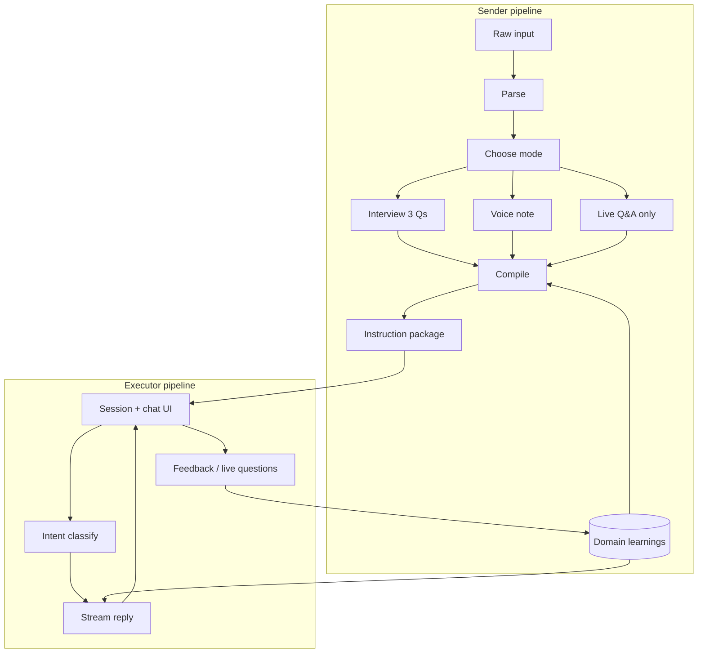

# Heiko

Someone wrote it. You have to do it. Heiko makes sure you actually can.

Heiko turns messy instructions (text, PDF, image, URL, or voice) into a guided, step-by-step experience for the person who has to execute them. Senders capture tacit knowledge once; executors get a WhatsApp-style coach that adapts in real time.

## Quick start

### 1. API keys and services

| Service | URL | Purpose |
|---------|-----|---------|
| Groq | [console.groq.com](https://console.groq.com) | LLM inference (Llama 3.3 70B, Whisper, vision) |
| Supabase | [supabase.com](https://supabase.com) | Postgres, auth, realtime |
| Redis | local or Upstash | Execution sessions + package cache |

Embeddings use a **local open-source model** (Transformers.js + MiniLM). No OpenAI key. First use downloads ~25MB into `.cache/transformers`.

### 2. Environment

Create `.env.local`:

```bash
GROQ_API_KEY=gsk_...
NEXT_PUBLIC_SUPABASE_URL=https://xxx.supabase.co
NEXT_PUBLIC_SUPABASE_ANON_KEY=eyJ...
SUPABASE_SERVICE_ROLE_KEY=eyJ...
REDIS_URL=redis://localhost:6379
NEXT_PUBLIC_APP_URL=http://localhost:3000

# Optional embeddings
# EMBEDDING_MODEL=Xenova/all-MiniLM-L6-v2
# EMBEDDING_PROVIDER=local
# EMBEDDING_PROVIDER=ollama
# OLLAMA_BASE_URL=http://127.0.0.1:11434
# DISABLE_EMBEDDINGS=true
```

### 3. Database

In Supabase **SQL Editor**, run in order:

1. `supabase/schema.sql`
2. `supabase/schema_v2.sql`
3. `supabase/schema_v3.sql`
4. `supabase/schema_v4.sql`

### 4. Run

```bash
npm install
npm run dev
```

Open [http://localhost:3000](http://localhost:3000).

For a concise top-level map of tech and data flow, see **[STRUCTURE.md](./STRUCTURE.md)**.

## How the engine works

Heiko has two pipelines: **sender** (build a package) and **executor** (run it). Both use Groq for language; domain memory uses local embeddings + Postgres.



### Sender pipeline

| Step | Route / UI | What happens |
|------|------------|--------------|
| Capture | `POST /api/parse`, `/send` | Text, image (vision), PDF, URL scrape, or voice (Whisper). Groq parses into structured **draft**: title, domain, steps, gaps, domainKnowledge. |
| Mode | `/send` | **Interview** (3 scored nuance questions), **Voice** (free-form note → structured Q&A), or **Live** (executor asks later; compile fills gaps from memory). |
| Interview | `POST /api/interview`, `/api/interview/voice` | Answers stored on `sender_drafts`. |
| Compile | `POST /api/compile` | Semantic search loads prior sender Q&A for this **domain** → injected into compile prompt → full **InstructionPackage** (steps, nuances, anticipatedQA, substitutions, checkpoints). Package saved + Redis cache warmed. New interview answers written to **domain_learnings** with embeddings. |
| Send | `POST /api/tasks` | Package linked to a contact; executor gets task/link. |

### Executor pipeline

| Step | Route / UI | What happens |
|------|------------|--------------|
| Start | `GET /api/execute?token=` | Load package (Redis cache or Supabase), create **ExecutionSession**, stream welcome message. |
| Chat | `POST /api/execute` | Fast model **classifies intent** (done, help, problem, substitute, question). For help/question/problem, **semantic search** pulls relevant prior sender answers. Smart model **streams** SSE reply; session updated (step index, history, pace). |
| Advance | same | `done` advances `currentStepIndex`; proactive check-ins use step duration. |
| Unknowns | `PATCH /api/feedback` | Executor questions logged; sender answers via `/sender/[token]` or **watch** live view. Answers merge into `anticipatedQA` and **domain_learnings**. |

### Domain knowledge and embeddings

- Table `domain_learnings`: per `(sender_id, domain)` question/answer pairs, `times_applied`, `embedding` (384-dim JSON).
- **Record**: on compile (interview), feedback POST, live answer POST → embed `Question + Answer` with **Xenova/all-MiniLM-L6-v2** (or Ollama if configured).
- **Search**: embed compile context (title, steps, gaps) or executor message + current step → cosine similarity over stored vectors; blend with top popular rows.
- **Backfill**: rows missing embeddings are embedded on next search (up to 20).

No pgvector required; search runs in the app. Optional `schema_v4` only adds `search_text` + `embedding` jsonb columns.

### AI stack

| Layer | File | Models |
|-------|------|--------|
| Client | `lib/groq.ts` | Groq OpenAI-compatible API |
| Fast | `FAST_MODEL` | `llama-3.1-8b-instant` (intent) |
| Smart | `SMART_MODEL` | `llama-3.3-70b-versatile` (parse, compile, execute) |
| Vision | `VISION_MODEL` | `llama-3.2-11b-vision-preview` |
| Voice | `/api/interview/voice` | Whisper via Groq |
| Embeddings | `lib/embeddings.ts` | Local MiniLM or Ollama `nomic-embed-text` |
| Prompts | `lib/ai/prompts.ts` | All system prompts |

Swap provider: change `baseURL` and model constants in `lib/groq.ts`.

### Data model (main tables)

| Table | Role |
|-------|------|
| `instruction_packages` | Compiled runnable package (`steps` jsonb, `share_token`, `sender_id`, `send_mode`) |
| `sender_drafts` | Parse/interview state before compile |
| `domain_learnings` | Sender memory per domain + embeddings |
| `package_questions` | Executor questions pending sender answer |
| `tasks` | Sent work items (sender ↔ contact), live help fields |
| `execution_events` | Analytics (intent, step) |
| `profiles` / contacts | Auth and address book (schema_v2+) |

Realtime: `package_questions` for live watch UI.

### Caching

- **Redis**: `session:{id}` (7d), `pkg:{shareToken}` (24h). Executor path reads package every message; cache avoids repeated Supabase reads.
- **Invalidate**: after sender updates feedback/anticipatedQA.

## App routes

| Path | Who | Purpose |
|------|-----|---------|
| `/` | Public | Marketing landing |
| `/login` | Auth | Supabase login |
| `/send` | Sender | Full send flow (input → mode → interview/voice → contact → done) |
| `/inbox` | Sender | Tasks sent/received (realtime refresh) |
| `/watch/[taskId]` | Sender | Live executor questions + answer |
| `/run/[token]` | Executor | Chat execution UI |
| `/sender/[token]` | Sender | Answer queued executor questions |
| `/task/[taskId]` | Either | Task detail |

## API reference

| Method | Path | Description |
|--------|------|-------------|
| POST | `/api/parse` | Parse raw input → draft + nuance questions |
| POST | `/api/interview` | Save interview answers |
| POST | `/api/interview/voice` | Transcribe + extract voice nuances |
| POST | `/api/compile` | Build package from draft |
| GET/POST/PATCH | `/api/execute` | Start session / stream chat |
| GET | `/api/package` | Lookup package by token |
| GET/POST/PATCH | `/api/feedback` | Pending questions + sender answers |
| GET/POST | `/api/tasks` | Inbox + send task |
| GET/POST | `/api/tasks/[id]/live` | Watch view Q&A |
| GET/POST | `/api/contacts` | Contact list + add by email |

## Project layout

```
app/
  page.tsx                 Landing
  (auth)/login/            Login
  (app)/send/              Sender flow
  (app)/inbox/             Task inbox
  (app)/watch/[taskId]/    Live watch
  run/[token]/             Executor chat
  sender/[token]/          Async sender answers
  api/                     HTTP handlers

components/
  sender/                  InputCapture, modes, interview, voice, watch
  executor/                ConversationUI (SSE)

lib/
  groq.ts                  LLM client
  embeddings.ts            Local semantic vectors
  domain-knowledge.ts      Store + search learnings
  redis.ts                 Sessions + package cache
  supabase.ts              DB clients
  auth.ts                  Server user helper
  types.ts                 Shared types
  ai/
    prompts.ts             Prompt templates
    pipeline.ts            Parse → interview → compile
    execution.ts           Intent + streaming execution

supabase/
  schema.sql … schema_v4.sql   Migrations
```

## Send modes

| Mode | Sender does | Compile behavior |
|------|-------------|------------------|
| `interview` | Answers 3 high-value nuance questions | Merges Q&A into steps; records learnings |
| `voice` | Records one voice note | Extracts Q&A from transcript; casual tone preserved |
| `live` | Skips upfront Q&A | Fills gaps from domain memory; executor questions answered in watch UI |

## Development notes

- **Build**: `npm run build` - `@xenova/transformers` is `serverExternalPackages` in `next.config.ts`.
- **Auth**: Supabase SSR; protected routes under `(app)/`.
- **Proxy**: `proxy.ts` refreshes auth session.

## License

Private / project-specific - add license as needed.
