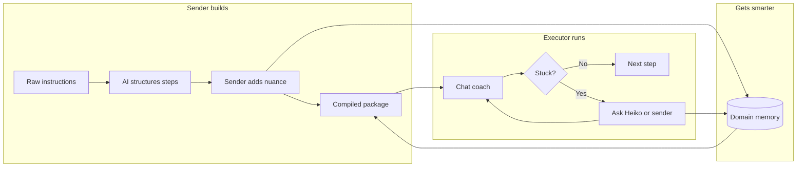

# Heiko - structure & problem (recruiter brief)

Use this doc to explain **what problem Heiko solves**, **how it works at a high level**, and **which technologies do what** - without going deep into implementation.

## Problem statement

People share instructions all the time - recipes, setup steps, onboarding checklists, repair guides - but the person doing the work still gets stuck.

**What goes wrong today:**

- Written instructions skip **tacit knowledge** (what "done" looks like, what to do when something feels wrong).
- The expert is not in the room when questions come up.
- The same questions get asked again on the next task.
- PDFs, voice notes, and chat messages are not structured for step-by-step execution.

**What Heiko does:**

Heiko sits between the **sender** (who knows how) and the **executor** (who has to do it). It turns messy input into a guided, chat-style runbook, captures the sender's extra know-how once, and **reuses that knowledge** on future tasks in the same domain (e.g. cooking, technical setup).

**One line:** Someone wrote it. You have to do it. Heiko makes sure you actually can.

## Who uses it

| Role | Need | Experience |
|------|------|------------|
| **Sender** | Turn instructions + personal tips into something others can follow | Upload or paste content, answer a few questions (or send live), pick a contact |
| **Executor** | Finish the task without bothering the sender for every step | Open a link, chat one step at a time, ask for help when stuck |

No account required for the executor - only a share link.

## How it works (high level)



**Build phase (sender)**

1. Paste text, upload a file, or record voice.
2. AI breaks content into clear steps and spots what's missing.
3. Sender enriches via a short interview, a voice note, or "answer later while they work" (live mode).
4. Heiko compiles a **instruction package** (steps, tips, Q&A, substitutions) and can assign it to a contact.

**Run phase (executor)**

1. Opens a link and gets a conversational guide - one step at a time.
2. Types things like "done", "I'm stuck", or "something went wrong".
3. A fast model classifies intent; a larger model streams a helpful reply.
4. If the package does not know the answer, the question goes to the sender.

**When the expert answers - two places at once**

| What happens | Who benefits |
|--------------|--------------|
| Answer is added to **this package** (`anticipatedQA` on the right step) | **Current executor** - on their next message, Heiko loads the updated package and can use that answer |
| Answer is saved to **domain memory** (embedded in `domain_learnings`) | **Future tasks** - same sender, same domain (e.g. another recipe or another person later) |

Same flow for answers from the feedback link (`/sender/[token]`) or the live watch screen (`/watch/[taskId]`).

**Memory (why it improves over time)**

- Sender answers are stored per **domain** (e.g. cooking vs technical).
- **Semantic search** (local embeddings) finds relevant past Q&A when compiling or when someone asks for help.
- The system gets better for that sender without re-entering the same tips.

## System structure (technical, still high level)

```
[ Browser: Next.js UI ]
        |
        +-- Groq ----------> Language AI (parse, coach, transcribe, read images)
        |
        +-- Supabase ------> Database, login, live updates
        |
        +-- Redis ---------> Fast session + package cache during execution
        |
        +-- Local ML ------> Embeddings for "find similar past answers" (no extra API bill)
```

| Piece | Technology | Purpose in one sentence |
|-------|------------|-------------------------|
| **Frontend & API** | Next.js, React, Tailwind | Marketing site, sender app, executor chat, server routes that call AI and DB |
| **Language AI** | Groq (Llama 3.x, Whisper, vision) | Structure instructions, generate questions, compile packages, coach executors in real time |
| **Memory / search** | Transformers.js (MiniLM, on-server) | Turn past Q&A into vectors and retrieve what matters for this task - no OpenAI embedding key |
| **Database** | Supabase (Postgres) | Users, contacts, packages, drafts, tasks, questions, long-term learnings |
| **Auth** | Supabase Auth | Senders log in; executors use links only |
| **Realtime** | Supabase Realtime | Sender can watch live when someone needs help |
| **Sessions** | Redis | Keep executor chat state and cache hot packages between messages |

## What each major part of the codebase is for

| Area | Role (non-technical) |
|------|----------------------|
| `app/(app)/send` | Sender flow: input -> mode -> send to contact |
| `app/run/[token]` | Executor chat experience |
| `app/(app)/watch` | Sender answers questions while executor is working |
| `lib/ai/pipeline.ts` | "Understanding" side: parse and compile instructions |
| `lib/ai/execution.ts` | "Coaching" side: intent + streaming replies |
| `lib/domain-knowledge.ts` | Save and search sender learnings across tasks |
| `supabase/schema*.sql` | Database setup (run migrations once in order) |

## Send modes (product choice, not tech depth)

| Mode | Sender effort up front | Best when |
|------|------------------------|-----------|
| **Interview** | Answer 3 targeted questions | You want quality before sending |
| **Voice** | Record one explanation | Faster than typing |
| **Live** | Minimal now; answer while they work | Executor starts immediately; sender fills gaps in real time |

## Talking points for interviews

- **Problem:** Instructions fail because expert knowledge is implicit and not available at execution time.
- **Solution:** Two-sided product - capture knowledge once, guide execution with AI, close the loop when unknowns appear.
- **AI design:** Split **fast** model (intent) vs **smart** model (coaching); structured JSON pipeline for packages, not one giant chat.
- **Differentiator:** **Domain memory** with open-source embeddings - expert answers help the **person running the task now** (package updated) and **everyone after** (semantic memory).
- **Stack choice:** Full-stack TypeScript (Next.js), managed Postgres (Supabase), cheap/fast inference (Groq), Redis for real-time session UX.

## If they ask "how deep is it?"

- Full-stack web app with auth, contacts, inbox, and realtime sender view.
- Multi-modal input (text, PDF, image, URL, voice).
- Streaming executor UI (SSE).
- Persistent learning layer (embed + search + store in Postgres).
- Not in scope for a v1 pitch unless you built it: native mobile, WhatsApp bot, payments.

## Related docs

- **INTERVIEW.md** - timed walkthrough: problem, system design, tradeoffs, failure modes (~15 min)  
- **README.md** - how to install, env vars, run locally  
- **supabase/schema.sql** through **schema_v4.sql** - run in order once per Supabase project  
